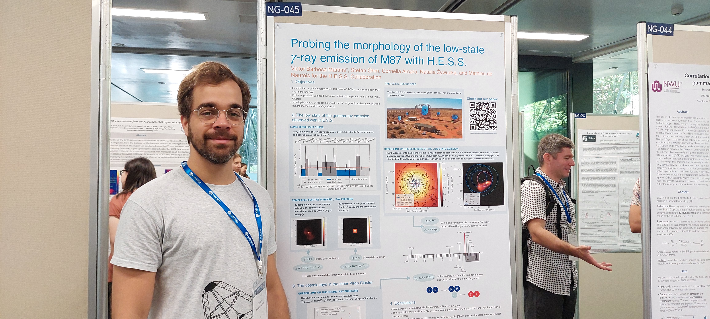
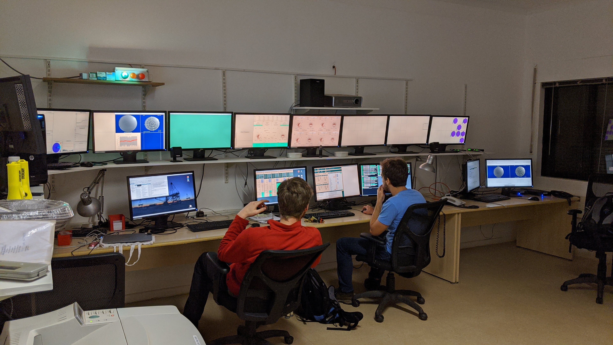

My name is Victor Barbosa Martins and I am, among many things, an astrophysicist! I originally come from Brazil but I live in Germany since 2018. 
Here, I succesfully completed my PhD at the Deutsches Elektronen Synchrotron ([DESY](https://www.desy.de/)) and at the Humboldt-Universität zu Berlin ([HU](https://www.hu-berlin.de/de)) in June 2022. Now I am working at DESY as a Postdoc with the developement of the simulation pipeline [simtools](https://github.com/gammasim/simtools) for [CTA](https://www.cta-observatory.org/). I am passionated about science and I continue working in some interesting questions using [H.E.S.S.](https://www.mpi-hd.mpg.de/HESS/) data. I am most interested in extragalactic astronomy, especially radio galaxies, galaxy clusters, the EBL and multiwalength astronomy. Please feel free to check some of my publications, my CV or drop me a message. Thank you and have a nice day! :)

## Highlights

### 2023
- **International Cosmic-ray Conference (ICRC Japan)**

### 2022

- **7th heidelberg international symposium on high-energy gamma-ray astronomy (Gamma 2022)**

- **PhD Defense**:
  

### 2020

- **Shift in Namibia (H.E.S.S.)**:
  

