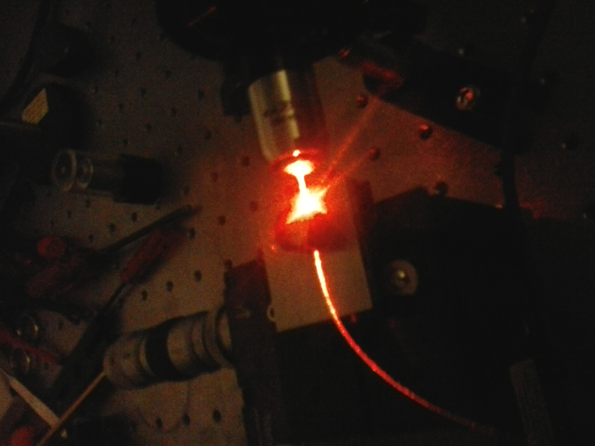

## Research projects

### 2022 -  (PostDoc)
- **The Simulation Pipeline (SimPipe) for CTA**
The DPPS Simulation Production Pipeline (SimPipe) is the system responsible to simulate the response of CTAO telescopes and model the relevant air shower physics and atmospheric conditions. It manages and validates the simulation model for the measurement processes and allows to produce event level simulated data for data levels MC-R1 and MC-DL0 from these validated MC models. SimPipe provides the necessary software, workflow definitions, data models and databases for the simulation model validation and MC production.

### 2018 - 2020 (PhD)
- **The structure health monitoring system for the Medium-sized telescope (MST) of CTA**
The main goal of the monitoring is to detect degradation and failures before critical damages occur, through the estimate of the Eigenfrequencies of the telescope and their damping rates and their monitoring over time. The structure monitoring concept system was applied to the prototype Medium Size telescope (MST) prototype of CTA in Berlin during late 2018 and in 2019. The system is also capable to detect mechanical changes, e.g. varying tension in the steel ropes of the camera support structure. The successful implementation of the structure monitoring system supports the decision of implementing the system in all future MSTs.

### 2016 - 2018 (Master's degree)
- **Developement, construction and tests of 40 Resistive Plate Chambers (RPCs) for the Pierre Auger Observatory**
Resistive Plate Chambers have shown to be suitable muon detector to be integrated into the Pierre Auger Observatory. We have built 40 units at USP in Sao Carlos (Brazil) with help of our colleagues from LIP, Coimbra, Portugal. The RPCs were mounted and succesfully tested.

### 2013 - 2014 (Bachelor's final project)
- **Characterization of Fiber Bragg Gratings in Multicore microstructured optical fibers**
During this internship at the Leibniz-Institut für Photonische Technologien (IPHT), Jena, I experimented with multicore microstructured optical fibers. Multi-core fibers are allow more light to be transported with good brilliance and fulfill image transmitting functions. To realize filter elements in these fibers, fiber Bragg grating (FBG) filter elements are used which are placed with an interference method into the multicore optical fiber (MCF) using a laser system. However, this method proved to be inefficient for multicore microstructured optical fibers. Ray-tracing simulations have shown that the fiber cores behave as lenses, preventing an isotropic coverage of the cross section of the fiber by the laser during the process of realization of the filters.

### 2010 - 2012 (Undergraduate project)
- **Ray tracing simulation for the electromagnetic shower**
Ray tracing simulation of the detection of Cherenkov radiation emitted by electromagnetic showers in the atmosphere for a paraboloic telescope, envisioning the upcoming CTA Observatory. The programming language C/C++ was used to develop a ray tracing algorithm. The algorithm produced the images of the showers as seen at the camera plane of the telescope as function of the shower's parameters, energy and incoming direction of the initial particle.
