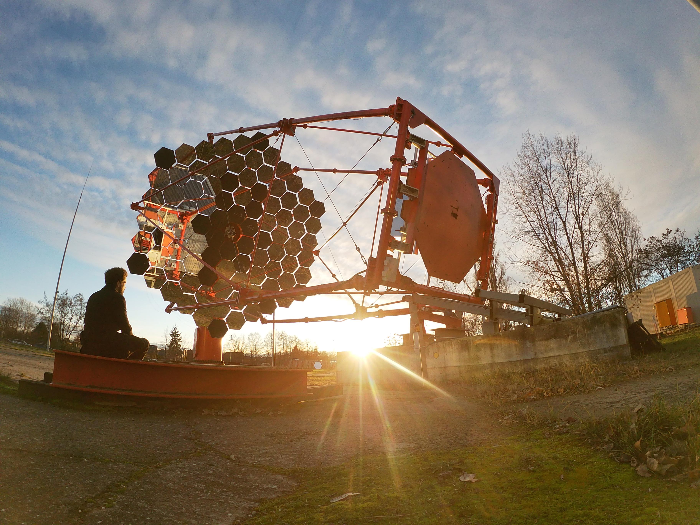
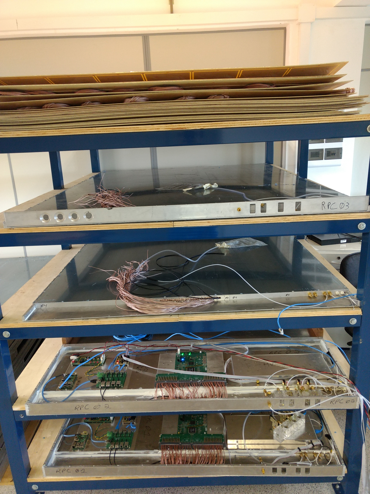
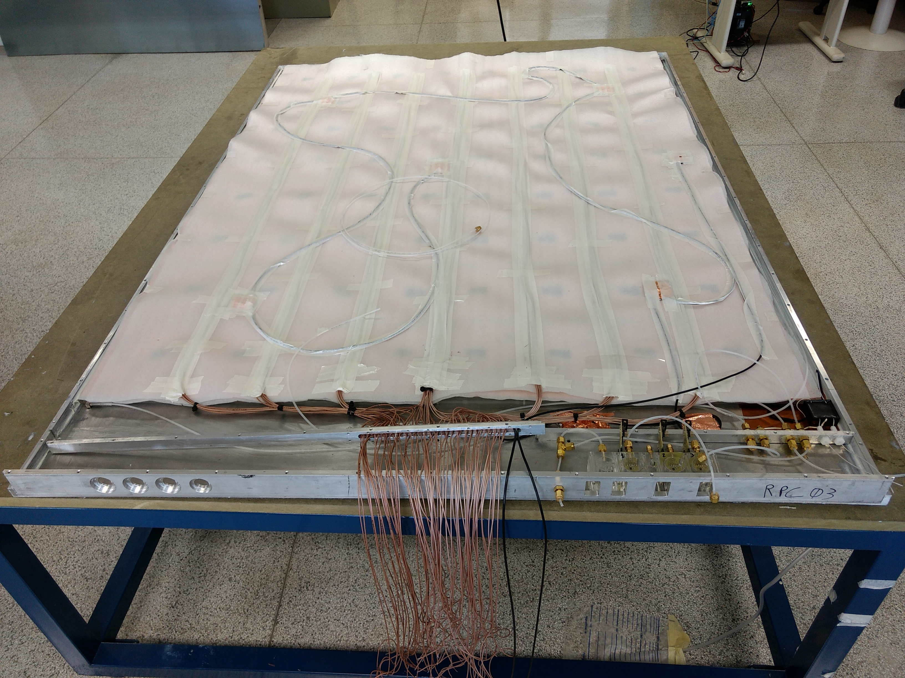
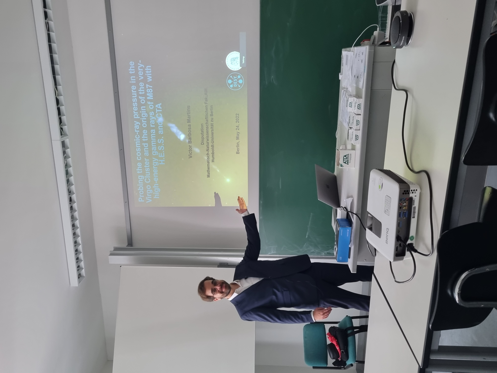

# Developement of the Simulation Pipeline (SimPipe) for CTA
**Summary**:

# Developement of the Medium-sized telescope (MST) health monitoring system for CTA
**Summary**: 

# Developement, construction and tests of 40 Resistive Plate Chambers (RPCs) for the Pierre Auger Observatory
**Summary**: 

# Other highlights
**PhD Defense**: 

**Shift in Namibia (H.E.S.S.)**: 

