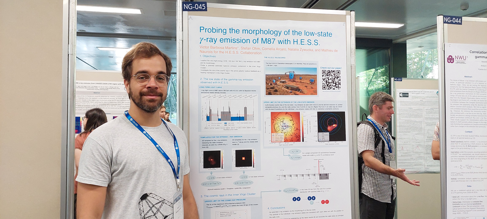
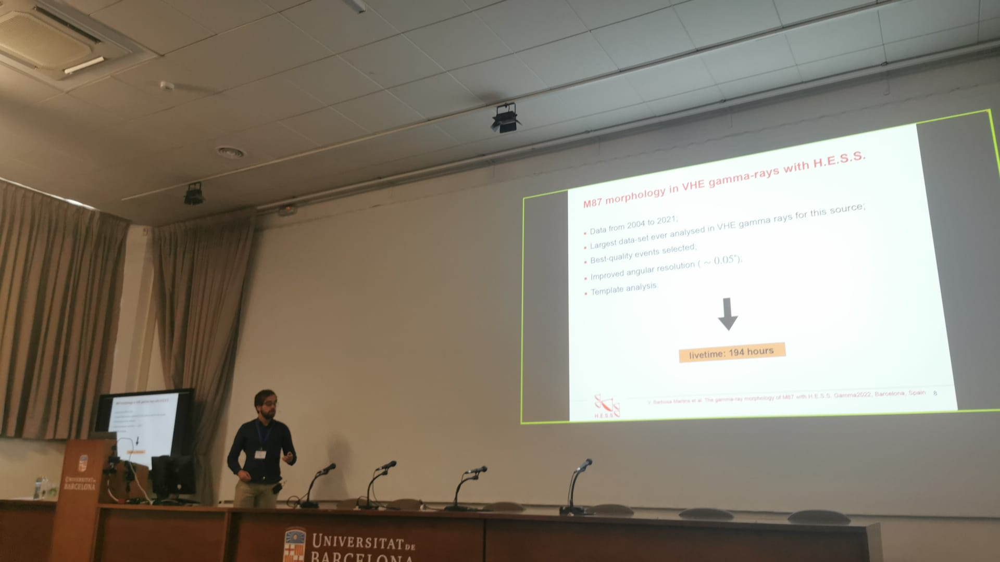

## Research projects

### 2023 - 
- **The Simulation Pipeline (SimPipe) for CTA**

### 2018 - 2020
- **The structure health monitoring system for the Medium-sized telescope (MST) of CTA**

### 2016 - 2018
- **Developement, construction and tests of 40 Resistive Plate Chambers (RPCs) for the Pierre Auger Observatory**

## Highlights

### 2023
- **International Cosmic-ray Conference (ICRC Japan)**

### 2022

- **7th heidelberg international symposium on high-energy gamma-ray astronomy (Gamma 2022)**

- **PhD Defense**: 

### 2020

- **Shift in Namibia (H.E.S.S.)**: 

